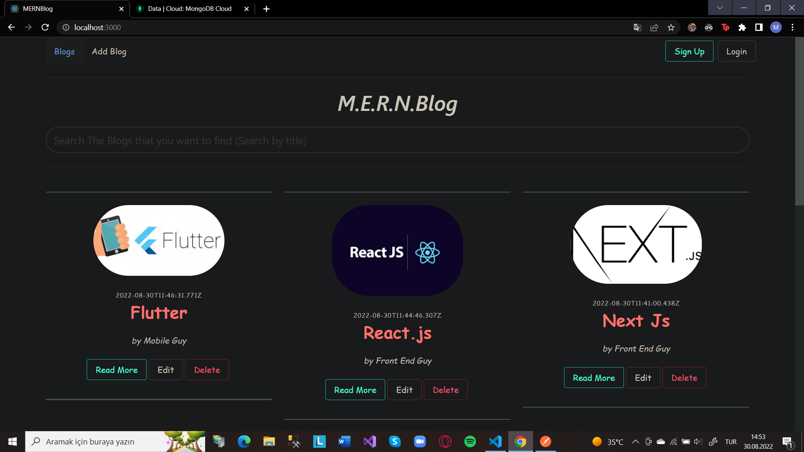
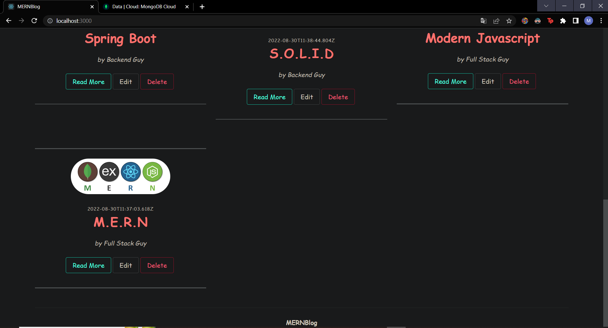
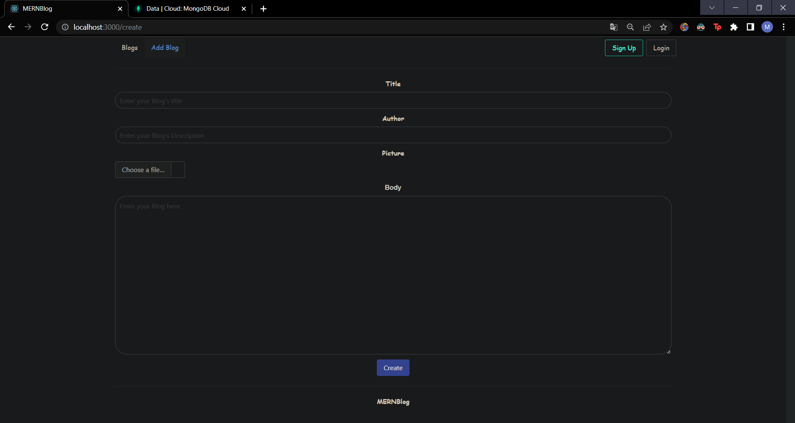
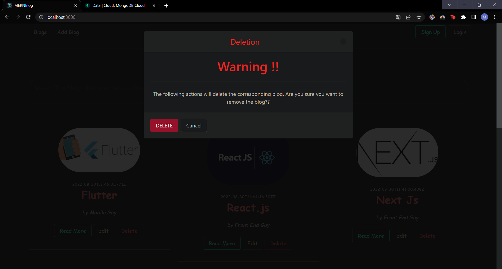
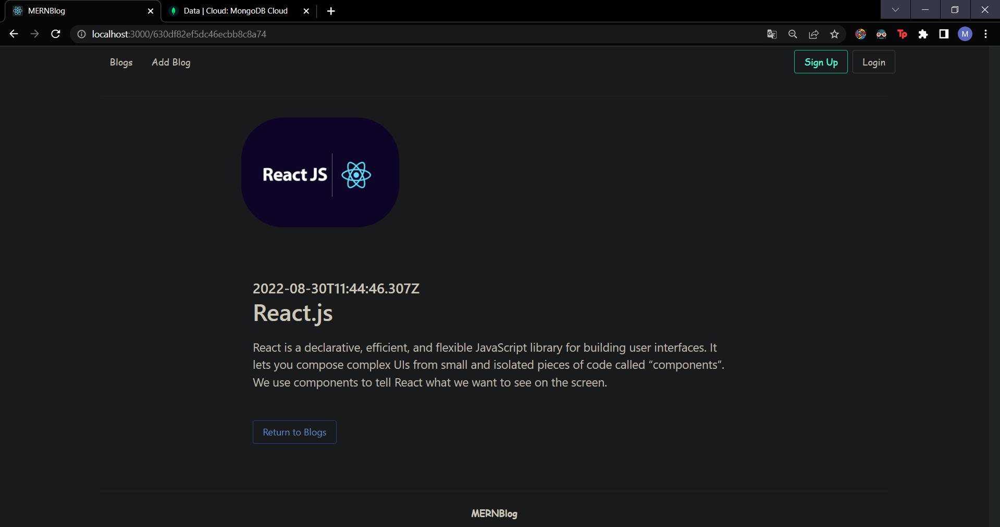
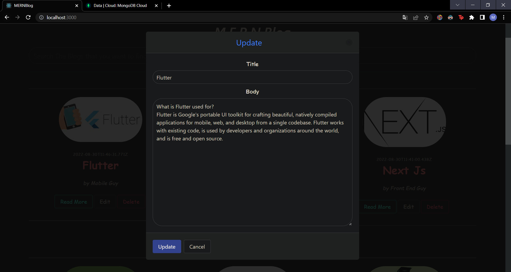

# MERNBlog

The MERNBlog is a Full Stack Development Project that was built with the Following Technologies:

&nbsp; 1- MongoDB -- A Nosql, Collection Based Databse  
&nbsp;2- Express.js -- A Javascript framework that is designed to simplify the server side javascript building  
&nbsp;3- React.js -- A Javascript library that is used for building User Interfaces.  
&nbsp; 4- Node.js -- A Javascript Environemnt that allows to use server side javascript.  

# Blog

The Project is a blog project in which users can create, read , update and delete blogs.

# Screenshots (Dark Mode)
</img>
</img>
</img>
</img>
</img>
</img>

# How to 
You need to start the server in order to access to the datas.
## To start the server:  
1- Go to the Server directory
 
2- Start the server by using the command:
`npm run start-server`

## To View the UI:
1- Go to the Client Directory   
2- Start the React app: `npm run start-client`

